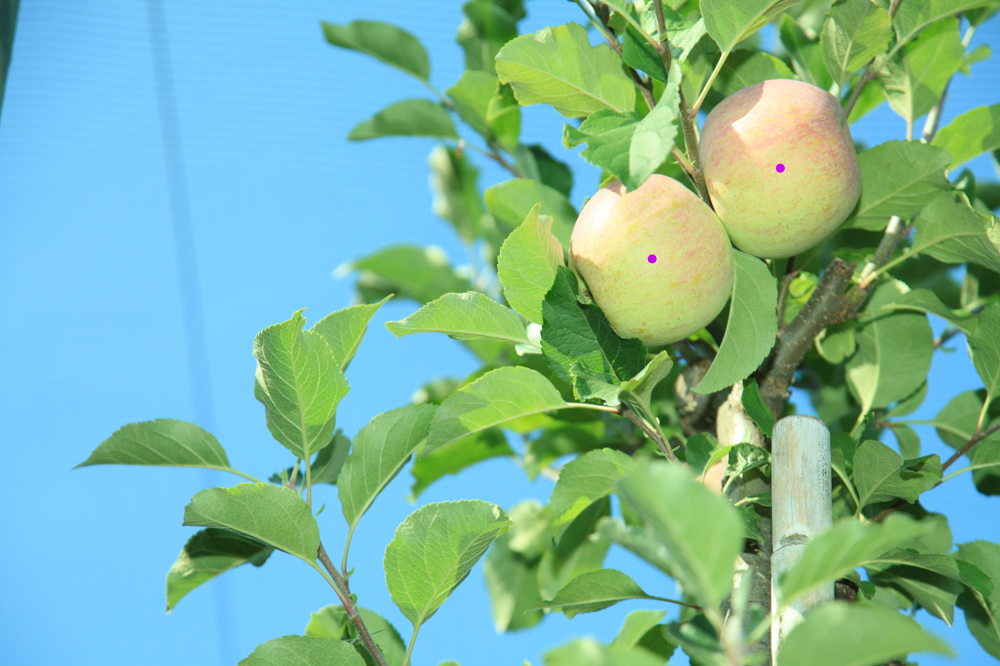

# Apple Detection Task

## Overview

This project provides a Python-based solution for detecting apples in images, using the Ultralytics YOLO model. The detection results include the coordinates of the centers of the apples, returned in pixels. This repository is structured to ensure simplicity, reusability, and clarity.

## Features
- Detect apples in images and extract their center coordinates.
- Configurable confidence and IoU thresholds for detection.
- Modular and reusable code.
- Visualization of detected apples on images.

---

### Directory Structure
```plaintext
apple-detection/
├── README.md
├── requirements.txt
├── src/
│   ├── main.py
│   ├── detection.py
│   ├── utils.py
│   └── visualization.py
├── models/
│   └── yolo11x.pt
├── images/
│   ├── input/
│   │   └── sample_image.jpg
│   └── output/
│       └── sample_image_with_detections.jpg
└── tests/
    └── test_detection.py
```

---

### Installation
1. Clone the repository:
   ```bash
   git clone https://github.com/iamdgarcia/apple-detection.git
   cd apple-detection
   ```
2. Install dependencies:
   ```bash
   pip install -r requirements.txt
   ```

3. Place your YOLO model file in the `models/` directory.

4. Add input images to `images/input/`.

---

### Usage
To detect apples and extract their coordinates:
```bash
python src/main.py
```
### Example Results
Here are some example results of apple detection:

#### Input Image
Original image from `images/input/`:


#### Output Image
Detected apples with their centers marked from `images/output/`:


Another example:



